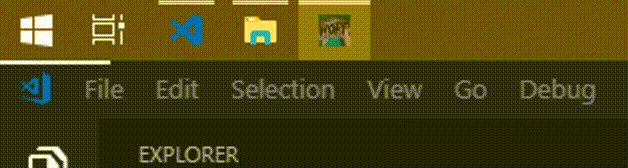

# Hope（盼头）

DT小工具系列 / DT Tools

一款用于时间管理的小工具。

## 预览

## 项目地址

https://github.com/CooloiStudio/Hope

## 下载地址

~~[GitHub Releases](https://github.com/CooloiStudio/Hope/releases)~~ — 暂无 release。

---

Hope（盼头）会在屏幕最上方显示一根分段彩色进度条，提示距离死线已经消耗了多少时间。  
简洁、非侵入式占屏，十分友好。及时提醒用户注意时间，提高效率，充满正能量。

「进度条」创意来自某微博用户，年代久远，已无法考证出处。

A lightweight tool that reminds you when you can go home.   
A little hope for leaving work on time.

---

## 功能特性

- 为多个任务设定时间、颜色与循环规则
- 在屏幕任意一边显示分段彩色进度条
- 自定义任务图标
- 点击穿透、不抢焦点、不参与 Alt+Tab / Win+Tab
- 悬停展示任务名与剩余时间
- 系统托盘：暂停/继续、显示/隐藏、快速打开设置

## 技术实现

完整架构、实现状态与开发指南见 [`Hope-产品与技术方案.md`](./Hope-产品与技术方案.md)。

---

## 常见问题 / FAQ

- **DT小工具是什么意思？**  
  是英文 Do it 的缩写，意思是行动，包含了积极向上的含义 `(๑•̀ㅂ•́)و✧`  
  Q: What is DT?   
  A: DT stands for "Dan Teng" in Chinese `_(:з」∠)_`

- ~~**为什么是白色？**~~  
  ~~因为你不能改。~~  
  ~~Q: Why white?~~  
  ~~A: I like it~~

- **刷新有什么用？**  
  进度条花了（变白/异常）就按一下：重建显示，并把进行中的即时任务起点拉回现在。  
  Q: What is "Refresh" for?  
  A: It makes the instant-task bar zoom ahead so you feel like you can clock out early. Cheating? Nah — just vibes.

- **不是说过就算死，从这跳下去，死外面，都不写桌面程序吗？**  
  真香！  
  Q: Translate server error  
  A: Awesome!

---

## 许可

MIT
